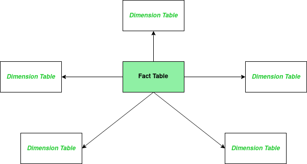
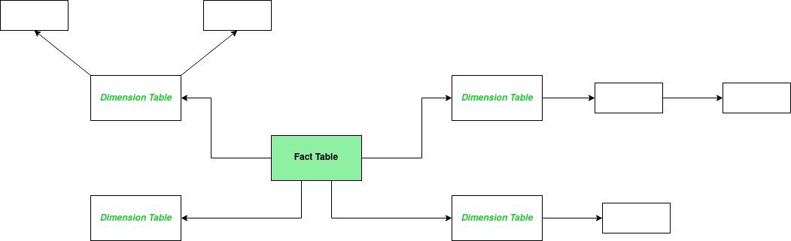
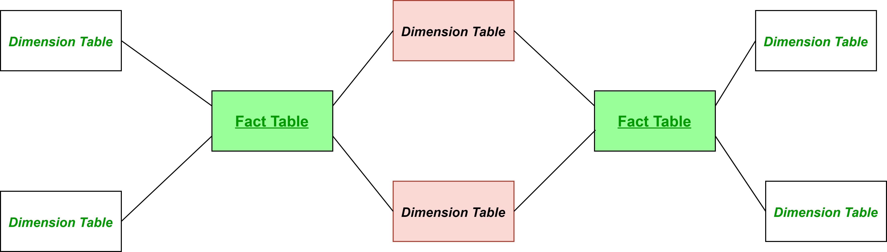
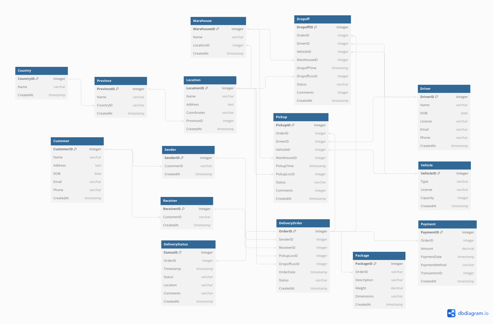

# Dimensional Data Model

# Table of content 
1.  What is dimensional data model?
   - Definition
   - Importance in Data Warehousing and Business Intelligence
2. Type of Dimensional Data Model
   - Star Schema
   - Snowflake Schema
   - Constellation Schema
3. Component of Star Schema 
   - Fact Table 
   - Dimension Table
   - Attributes and Hierarchies
4. Dimensional Data Model Design Process
5. Case Study 

# 1. What is dimensional data model?
- Definition
  
  A Dimensional Data Model is a structured framework for organizing and analyzing data efficiently, emphasizing simplicity for reporting and analysis
- Importance in Data Warehousing and Business Intelligence
  
  Crucial for constructing decision support systems in data warehousing and business intelligence, enabling organizations to extract meaningful insights from data.
# 2. Type of Dimensional Data Model
  - Star Schema
    + characterized by a central fact table connected to multiple dimension tables
    + the fact table contains quantitative data, and dimensions provide context with descriptive information
    + an efficient choice for many business intelligence applications because of the simplicity and ease of querying
      
  - Snowflake Schema
    + an extension of the star schema where dimension tables are normalized
    + more complexity in queries and maintenance
      
  - Constellation Schema
    + is not a standalone schema but a collection of multiple star schemas that share some common dimensions
    + each star schema corresponds to a specific business process, and shared dimensions enable integration and analysis across different processes
    + provides flexibility in handling diverse business requirements
      
  - Comparison
    
      | Aspect | Star Schema | Snowflake Schema | Constellation Schema |
      | -------- | -------- | -------- | ---------| 
      | Structure | Centralized structure with a single fact table | Centralized structure, but dimensions are normalized | Collection of multiple star schemas sharing common dimensions|
      | Complexity | Simple structure with less complexity | More complex due to normalized dimensions | Varied complexity based on the structure of individual star schemas|
      |Dimensions|Denormalized dimensions for easy querying|Normalized dimensions, more storage efficiency|Shared and specific dimensions for different business processes|
      |Query Performance|Generally faster due to denormalized structure|May have slightly slower performance due to joins|Performance can vary based on the structure of individual star schemas|
      |Maintenance|Easier to maintain with fewer tables|More challenging maintenance due to normalization|Maintenance may involve updates across multiple star schemas|
      |Storage Space|May require more storage space|Can save storage space through normalization|Storage space can vary based on the structure of individual star schemas|
      |Flexibility|More rigid, but efficient for specific use cases|Offers flexibility with normalized dimensions|Flexible, accommodating diverse business requirements|

   - In practical terms, companies utilize a range of business processes, with the Constellation Schema being a frequently employed tool for business intelligence. Below, I provide details about the Constellation Schema, but for simplicity, I refer to it as the Star Schema (Constellation Schema based on Star Schema)
    
# 3. Components of Star Schema
   Initially, it is essential to comprehend the facts 
   - These are numerical values
   - Represents the performance measures of the business activity
   - Examples: Productivity, expenses, sales, profit, prices, quantity
   - Facts are also called measures. They are stored in the fact table

   A star schema has four main components: Fact table, Dimension tables, Attributes, Attribute hierarchies
   - Fact Table
     + Definition
       
       The fact table in each star schema holds quantitative data specific to the corresponding business process. It serves as the central repository for measurable metrics
     + Contents
       
       Fact tables include numerical data relevant to the business process, such as sales revenue, quantities sold, or other key performance indicators.
     + Relationships
       
        Fact tables establish relationships with dimension tables within the same star schema through foreign keys, facilitating comprehensive analysis.
     + Type of fact table
       
       _Transactional Fact Table_: Stores detailed transactional data at a low level of granularity
       
          | TransactionID | ProductID | CustomerID |SalesAmount |Quantity | TransactionDate|
          | -------- | -------- | -------- |---|---|---|
          | 1 | 101 | 201 |500.00|2|2023-01-15 08:30:00|
          | 2 | 102 | 202 |300.00|1|2023-01-16 12:45:00|
          | 3 | 103 | 203 |100.00|3|2023-01-17 09:15:00|
          
       _Periodic Snapshot Fact Table_: Captures periodic snapshots of business processes at specific intervals
    
          | SnapshotID | ProductID | TotalSalesAmount | SnapshotMonth | 
          | -------- | -------- | -------- |---|
          | 1 | 101 | 5000.00 |January|
          | 2 | 102 | 3200.00 |January|
          | 3 | 103 | 1500.00 |January|
       
       _Accumulative Snapshot Fact Table_: Tracks cumulative values over time, useful for performance monitoring

          | SnapshotID | ProductID | TotalRevenue | SnapshotYear | 
          | -------- | -------- | -------- |---|
          | 1 | 101 | 5000.00 |2022|
          | 2 | 102 | 3200.00 |2022|
          | 3 | 103 | 1500.00 |2022|
    
   - Dimension Table
     + Definition
    
       Dimension tables within each star schema store descriptive attributes providing context to the quantitative data in the corresponding fact table
     + Contents

       Dimension tables include attributes specific to the business process, such as product details, customer information, and time periods
     + Relationships

       Dimension tables are linked to the fact table within the same star schema through foreign keys, enabling a deeper understanding of the data
     + Type of dimension table

       _Conformed Dimension Table_: Maintains consistency across multiple star schemas, ensuring uniformity in data interpretation
       
          | ProductID | ProductName | Category | Manufacturer | 
          | -------- | -------- | -------- |---|
          | 101 | Laptop | Electronics |ABC Electronics|
          | 102 | Smartphone | Electronics |XYZ Technologies|
          | 103 | Desk Chair | Furniture |Furniture Co|       

       _Slowly Changing Dimension (SCD)_: Manages dimensions that evolve over time, preserving historical information
    
       + SCD Type 1: Overwrite (No History)
       + 
         Definition: Overwrites existing data with new values when a change occurs, without preserving historical information
         
         Example: EmployeeDimensionSCD1 - If an employee's information changes, the existing row is simply updated without preserving historical records

          | EmployeeID | EmployeeName | Department | StartDate | EndDate|
          | -------- | -------- | -------- |---| --- |
          | 101 | John Doe | IT |2022-01-01| 9999-12-31 |
          | 102 | Jane Smith | Finance |2022-03-15| 9999-12-31 |
          | 103 | Bob Johnson | HR |2023-02-01| 9999-12-31 |
         
       _Junk Dimension Table_: Consolidates low-cardinality flags and attributes to reduce dimensionality
       
   - Attributes and Hierarchies
# 4. Dimensional Data Model Design Process
- Identify the business process: The operational activities being modeled
- Declare the grain: The lowest level of information
- Define Dimension Tables: Contain the descriptive entities of the data
- Identify the Facts: are the numeric measurements that result from a business process

  A Fact Table contains:
  + The numeric measures
  + Foreign keys of the associated dimensions
  + Degenerate dimension keys
  + Date/time stamps
# 5. Case Study 
In the realm of data analysis, it's common for Data Analysts to construct dimensional data models based on existing databases. The following is a simple model generated based on my experience

It's designed for a Delivery Company, managing aspects like order creation, pickup, dropoff, and payment

Step 1: Identify the business process
- Process of order creation 
- Process of fulfillment
- Process of payment

Step 2: Declare the grain 

# 6. Support links
- https://www.holistics.io/blog/the-three-types-of-fact-tables/
- https://www.geeksforgeeks.org/components-and-analysis-of-star-schema-design/
- https://www.holistics.io/blog/scd-cloud-data-warehouse/

