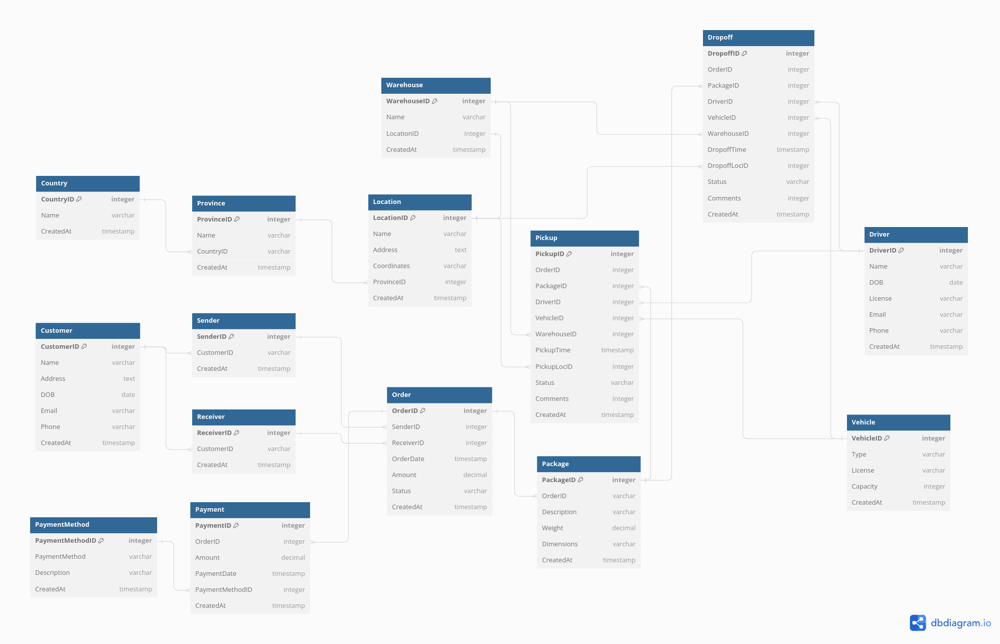

# Dimensional Data Model (Star Schema)

# Table of content 
1.  What is dimensional data model?
   - Definition
   - Importance in Data Warehousing and Business Intelligence
2. Type of Dimensional Data Model
   - Star Schema
   - Snowflake Schema
   - Constellation Schema
3. Component of Star Schema 
   - Facts
   - Dimensions
   - Attributes and Hierarchies
4. Dimensional Data Model Design Process
5. Case Study 

# 1. What is dimensional data model?
- Definition
  
  A Dimensional Data Model is a structured framework for organizing and analyzing data efficiently, emphasizing simplicity for reporting and analysis
- Importance in Data Warehousing and Business Intelligence
  
  Crucial for constructing decision support systems in data warehousing and business intelligence, enabling organizations to extract meaningful insights from data.
# 2. Type of Dimensional Data Model
  - Star Schema
    + characterized by a central fact table connected to multiple dimension tables
    + the fact table contains quantitative data, and dimensions provide context with descriptive information
    + an efficient choice for many business intelligence applications because of the simplicity and ease of querying
  - Snowflake Schema
    + an extension of the star schema where dimension tables are normalized
    + more complexity in queries and maintenance
  - Constellation Schema
    + is not a standalone schema but a collection of multiple star schemas that share some common dimensions
    + each star schema corresponds to a specific business process, and shared dimensions enable integration and analysis across different processes
    + provides flexibility in handling diverse business requirements
  - Comparison
    
   | Header 1 | Header 2 | Header 3 | Header 4 |
   | -------- | -------- | -------- | ---------| 
   | Content 1 | Content 2 | Content 3 | |
   | Content 4 | Content 5 | Content 6 | |
# 4. Dimensional Data Model Design Process
- Identify the business process: The operational activities being modeled
- Declare the grain: The lowest level of information
- Define Dimension Tables: Contain the descriptive entities of the data
- Identify the Facts: are the numeric measurements that result from a business process

  A Fact Table contains:
  + The numeric measures
  + Foreign keys of the associated dimensions
  + Degenerate dimension keys
  + Date/time stamps
# 5. Case Study 
In the realm of data analysis, it's common for Data Analysts to construct dimensional data models based on existing databases. The following is a simple model generated by ChatGPT, with additional tables and attributes based on my experience

It's designed for a Delivery Company, managing aspects like order creation, pickup, dropoff, and payment

Step 1: Identify the business process
- Process of order creation 
- Process of fulfillment
- Process of payment

Step 2: Declare the grain 
